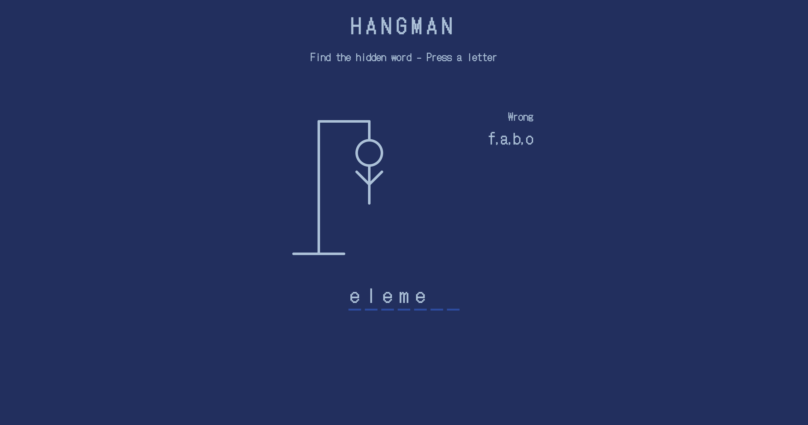

# Hangman Game

A simple and interactive Hangman game built using HTML, CSS, and JavaScript. The objective of the game is to guess the hidden word by entering letters before the hangman figure is fully drawn.

## Live Preview

You can try the game live [here](https://hangman-ochre-two.vercel.app/).

## Screenshots

**Game Interface**

## Features

- Randomly selects a word from a predefined list.
- Displays correct and wrong letters as you guess.
- Shows a notification if you enter a letter that has already been guessed.
- Displays a popup message when the game is won or lost.
- Option to play again after the game ends.

## Technologies Used

- **HTML**: For structuring the game interface.
- **CSS**: For styling the game and making it visually appealing.
- **JavaScript**: For game logic and interactivity.

## How to Play

1. Open the game in your browser.
2. Press any letter key on your keyboard to guess a letter.
3. Correct guesses will reveal the letter in the word.
4. Wrong guesses will add parts to the hangman figure.
5. Win the game by guessing the word before the hangman figure is fully drawn.
6. If you lose, the correct word will be revealed, and you can play again by clicking the "Play Again" button.

## Project Structure
Hangman/ ├── index.html # Main HTML file ├── style.css # Stylesheet for the game ├── script.js # JavaScript file for game logic └── readme.md # Project documentation

## How to Run the Project

1. Clone the repository or download the project files.
2. Open the `index.html` file in your browser.
3. Start playing the game!

## Future Improvements

- Add difficulty levels with varying word lengths.
- Implement a scoring system.
- Add sound effects for correct and wrong guesses.
- Make the game mobile-friendly.

## License

This project is open-source and available under the [MIT License](https://opensource.org/licenses/MIT).

---
Enjoy the game and have fun guessing!
